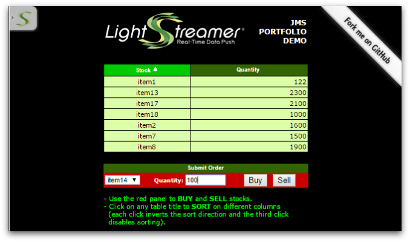

# Lightstreamer JMS Gateway - Basic Portfolio Demo - HTML Client

<!-- START DESCRIPTION lightstreamer-jms-example-portfolio-client-javascript -->

This project includes a front-end example based on the Basic Portfolio Demo for Lightstreamer JMS gateway.

## Details

In the JMS Portfolio Demo, a virtual stock portfolio, shared among all the connected users, is displayed.
By using the "Submit Order" panel, you can buy or sell a stock (identified by an item number), filling in the Quantity field and pressing the proper button.<br>
The portfolio grid is updated in push mode, for both the columns and the rows (this is the so called "metapush" feature).<br>
This page uses the <b>JMS JS Client API for Lightstreamer</b> on top of [JavaScript Client API for Lightstreamer](http://www.lightstreamer.com/docs/client_javascript_uni_api/index.html) to handle the communications with Lightstreamer Server.<br>

Check out the sources for further explanations.



<!-- END DESCRIPTION lightstreamer-jms-example-portfolio-client-javascript -->

## Install

Before you can run the demo of this project some dependencies need to be solved:

* Note that, as prerequisite, the [Lightstreamer JMS Gateway - Stock-List Demo - Java (JMS) Service](https://github.com/Weswit/Lightstreamer-JMS-example-Portfolio-service-java) has to be deployed on your local Lightstreamer Server instance (running a properly configured JMS Gateway). Please check out that project and follow the installation instructions provided with it.
* Launch Lightstreamer Server.
* Get the `lightstreamer-jms.js` file from the [Lightstreamer JMS Gateway](http://download.lightstreamer.com/#jms) and put it in the root folder of this project.
* Lightstreamer JS client is currently hot-linked in the html page: you may want to replace it with a local version and/or to upgrade its version.
* RequireJS is currently hot-linked in the html page: you may want to replace it with a local version and/or to upgrade its version.
* jQuery is currently hot-linked in the html page: you may want to replace it with a local version and/or to upgrade its version.

Now, you need to configure the `portfolio.js` of this example by specifying the name of the data adapter you are going to use. By default the demo will look for the <b>HornetQ</b> data adapter, please refer to the related [Service project](https://github.com/Weswit/Lightstreamer-JMS-example-Portfolio-service-java) for more details on the choice of a JMS broker to be used.
To set the data adapter name and the connection name look where the connection is created:

```js
  ConnectionFactory.createConnection("http://localhost:8080/", "JMS", "HornetQ", null, null, {
```

To access the demo from a web browser copy it somewhere under your root webserver directory. You can also add it to the standard Lightstreamer demo pages under `LightstreamerHome/pages/demos` directory and access it as: <i>http://_your lightstreamer http address_/demos/PortfolioDemo_JMS/</i>.

## See Also

### Lightstreamer Service Needed by This Demo Client

<!-- START RELATED_ENTRIES -->
* [Lightstreamer JMS Gateway - Portfolio Demo - Java (JMS) Service](https://github.com/Weswit/Lightstreamer-JMS-example-Portfolio-service-java)

<!-- END RELATED_ENTRIES -->

### Related Projects

* [Lightstreamer JMS Gateway - Basic Stock-List Demo - HTML Client](https://github.com/Weswit/Lightstreamer-JMS-example-StockList-client-javascript)
* [Lightstreamer JMS Gateway - Basic Chat Demo - HTML Client](https://github.com/Weswit/Lightstreamer-JMS-example-Chat-client-javascript)
* [Lightstreamer - Portfolio Demos - HTML Clients](https://github.com/Weswit/Lightstreamer-example-Portfolio-client-javascript)

## Lightstreamer Compatibility Notes

* Compatible with Lightstreamer JavaScript Client library version 6.1 or newer.
* Compatible with Lightstreamer JMS Gateway Adapter since version 1.1 or newer.
